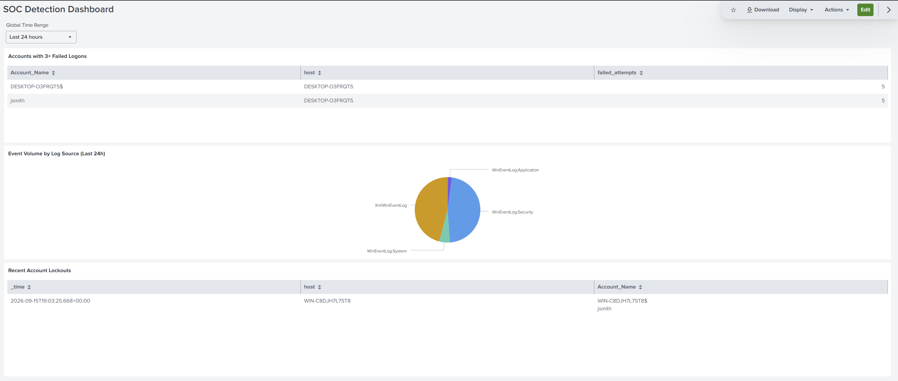
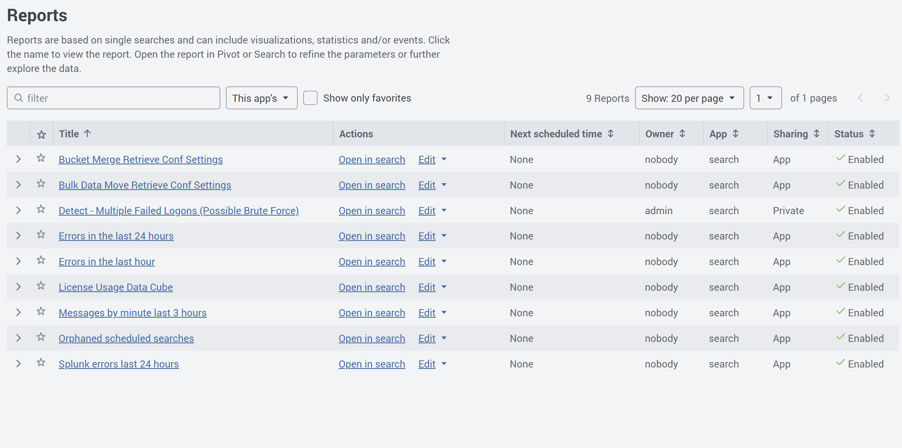
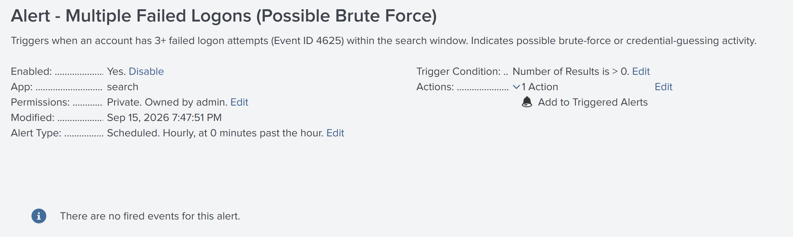
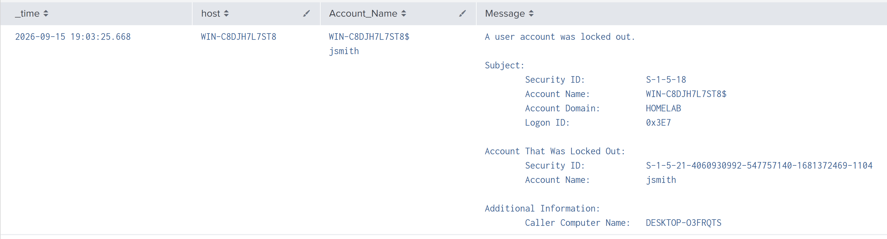
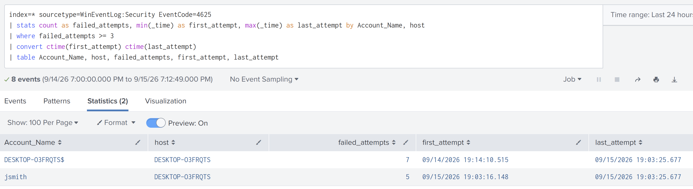

# SOC & Detection Engineering Lab

A hands-on Security Operations Center lab: centralized log collection, custom detection engineering, and incident response — built on Splunk, Sysmon, and Windows Event Logs, with detections documented as portable Sigma rules and mapped to MITRE ATT&CK.

**Author:** Ahmed Mahdy | Security+ | ISC2 CC | TryHackMe Top 1% Global
**Environment:** VMware Workstation, Windows Server 2025 (DC), Windows 11 Enterprise (client), Ubuntu Server 26.04 LTS running Splunk Enterprise

---

## 🎯 Objective

Build a working small-scale SOC pipeline to practice and demonstrate:
- Centralized log ingestion from Windows hosts into Splunk (Security/System/Application logs + Sysmon)
- Writing custom SPL detection queries and converting them into saved searches and scheduled alerts
- Documenting detections as vendor-neutral **Sigma rules**, mapped to MITRE ATT&CK
- Investigating and reporting a live security event following the **NIST SP 800-61** incident handling framework

## 🧱 Lab Architecture

| VM | Role | OS | Specs |
|---|---|---|---|
| DC01 (`WIN-C8DJH7L7ST8`) | Domain Controller, log source | Windows Server 2025 | 4 vCPU, 8 GB RAM |
| WKS01 (`DESKTOP-O3FRQTS`) | Domain client, log source | Windows 11 Enterprise | 4 vCPU, 8 GB RAM |
| SPLUNK01 | Splunk Enterprise (SIEM) | Ubuntu Server 26.04 LTS | 4 vCPU, 8 GB RAM |

- **Network:** Isolated VMware custom network (VMnet2), static IPs (`192.168.38.10 / .20 / .131`)
- **Log pipeline:** Sysmon (SwiftOnSecurity config) + Splunk Universal Forwarder → Splunk Enterprise, port 9997
- **Note on hostnames:** DC01 and WKS01 are the lab's logical names; Splunk reports them under their actual Windows-assigned hostnames (`WIN-C8DJH7L7ST8` and `DESKTOP-O3FRQTS` respectively) — both refer to the same machines throughout this repo.

## 📊 Detection Dashboard

A three-panel Splunk dashboard (Dashboard Studio, Grid layout) providing a SOC-style overview:



- **Accounts with 3+ Failed Logons** — live view of the brute-force detection query
- **Event Volume by Log Source** — visibility into what's actually being ingested (Security, System, Application, Sysmon)
- **Recent Account Lockouts** — quick reference for Event ID 4740 activity

## 🔍 Detection: Multiple Failed Logons (Brute Force)

**SPL query:**
```spl
index=* sourcetype=WinEventLog:Security EventCode=4625
| stats count as failed_attempts, min(_time) as first_attempt, max(_time) as last_attempt by Account_Name, host
| where failed_attempts >= 3
| convert ctime(first_attempt) ctime(last_attempt)
| table Account_Name, host, failed_attempts, first_attempt, last_attempt
```

This was saved as a Splunk **Report** and promoted to a **scheduled Alert** (hourly, triggers on Number of Results > 0, logs to Triggered Alerts) — demonstrating the full detection lifecycle from ad-hoc query to standing detection.




## 📄 Sigma Rules

Three detections documented in [Sigma](https://github.com/SigmaHQ/sigma) format — a vendor-neutral rule syntax that can be converted to Splunk SPL, Elastic, Sentinel KQL, and other platforms via `sigma-cli`:

| Rule | MITRE ATT&CK | Description |
|---|---|---|
| [`multiple_failed_logons.yml`](sigma-rules/multiple_failed_logons.yml) | T1110 (Brute Force) | 3+ failed logons for one account in a 5-minute window |
| [`account_lockout.yml`](sigma-rules/account_lockout.yml) | T1110 (Brute Force) | Windows account lockout event (4740) |
| [`suspicious_process_from_office.yml`](sigma-rules/suspicious_process_from_office.yml) | T1059, T1566.001 | Office application spawning a shell/script interpreter — common macro-phishing pattern, detected via Sysmon |

## 🧪 Live Detection Test

To validate the pipeline end-to-end, an account lockout was deliberately triggered against `jsmith` (5 failed logon attempts from WKS01) and traced through the full detection chain: Sysmon/Event Log → Universal Forwarder → Splunk ingestion → SPL detection query → Event ID 4740 confirmation on the Domain Controller.




📄 **Full incident investigation report (NIST SP 800-61 aligned):** [incident-investigation-report.md](./incident-investigation-report.md)

## 🧩 Challenges & Troubleshooting

- **Sysmon events not appearing in Splunk**: traced to the Universal Forwarder's install wizard only covering default Application/Security/System event logs — Sysmon's custom event channel (`Microsoft-Windows-Sysmon/Operational`) required a manually added `inputs.conf` stanza
- **`inputs.conf` edits silently not saving**: Notepad's save dialog redirected the file elsewhere when run without matching permissions; resolved by writing the config directly via PowerShell (`Out-File`) instead
- **Sourcetype renamed after installing the Splunk Sysmon add-on**: the add-on's own field-extraction rules didn't match the renamed sourcetype, leaving key fields (`EventCode`, `Image`, `CommandLine`) blank; resolved with a manual `rex` field extraction against the raw XML, which is used throughout this project's Sysmon-based searches
- **Account lockout policy not triggering during initial live test**: root cause was the same domain account-policy precedence issue identified in the AD/IAM lab (Project 1) — account policies only take effect from the highest-precedence GPO at the domain root

## 🛠️ Tools Used

Splunk Enterprise · Splunk Universal Forwarder · Sysmon (SwiftOnSecurity config) · Sigma · MITRE ATT&CK · Ubuntu Server 26.04 LTS · VMware Workstation Pro

## 📁 Repository Structure

```
soc-detection-engineering-lab/
├── README.md
├── incident-investigation-report.md
├── sigma-rules/
│   ├── multiple_failed_logons.yml
│   ├── account_lockout.yml
│   └── suspicious_process_from_office.yml
└── screenshots/
```

---

*Part of a broader cybersecurity home lab portfolio. See related projects: Active Directory & IAM Security Lab · Vulnerability Assessment (Nessus/Nmap) · Microsoft Sentinel KQL Detection · Web Application Security Testing · Network & Threat Analysis.*
